# Wazuh Proof-of-Concept: SSH Brute-Force Attack Detection

A hands-on lab demonstrating the deployment of a full Wazuh SIEM stack (Manager, Indexer, Dashboard) and its real-time detection capabilities against a simulated SSH brute-force attack using Hydra.

**Author:** Sheeza Alam Khan
**Date:** 21 November 2025

---

##  Objective

Deploy a fully functional Wazuh environment and demonstrate its real-time detection capabilities using an SSH brute-force attack scenario, including alert generation, rule triggering, and MITRE ATT&CK mapping.

---

##  Lab Environment

| Component | Hostname | IP Address | Role | Wazuh Version |
|---|---|---|---|---|
| Wazuh All-in-One | Wazuh-Server | `192.168.52.134` | Manager, Indexer, Dashboard | 4.14.1 |
| Endpoint 1 | Kali Linux | `192.168.52.130` | Monitored agent / Attacker (Hydra) | 4.14.1 |
| Endpoint 2 (Victim) | vm2 | `192.168.52.133` | Monitored agent (target) | 4.14.1 |

All components were deployed using the official **Wazuh Proof-of-Concept OVA**, with additional VMs provisioned in **VMware Workstation**.

### Network Configuration

<table>
<tr>
<td><b>Kali Linux</b></td>
<td><b>vm2</b></td>
</tr>
<tr>
<td>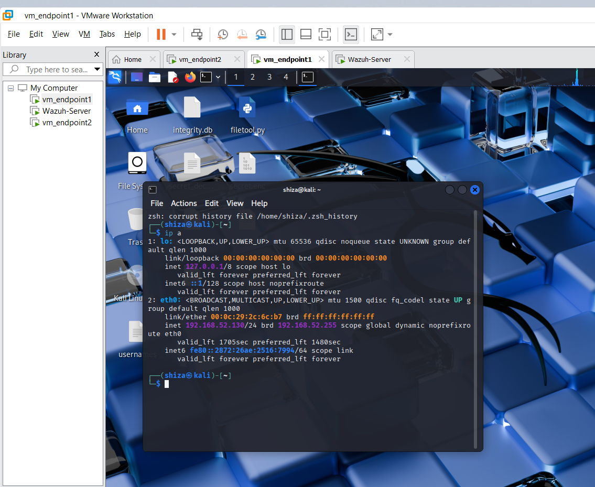</td>
<td>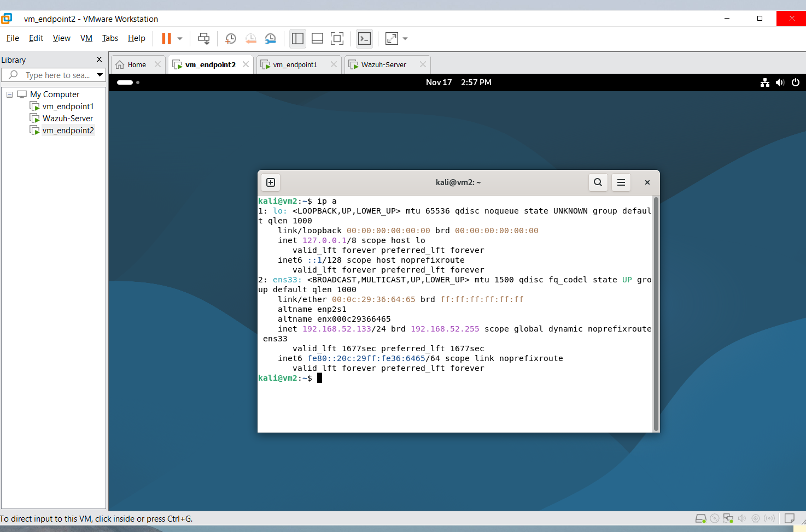</td>
</tr>
</table>

**Wazuh-Server**

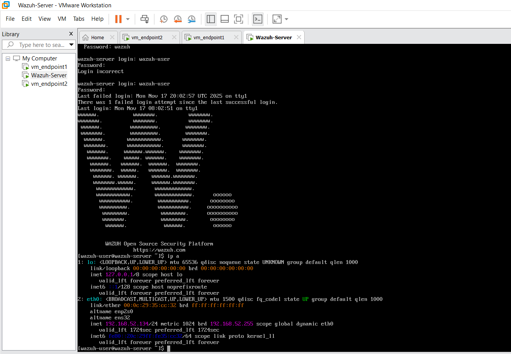

---

##  Deployment Steps

1. Imported and started the official Wazuh All-in-One OVA
2. Added and registered three agents (Wazuh-server, vm2, Kali) using `/var/ossec/bin/manage_agents`
3. Verified agent connectivity and status in the Wazuh dashboard
4. Confirmed all services (`wazuh-manager`, `wazuh-indexer`, `wazuh-dashboard`) are active

**Registered agents (`agent_control -l`)**

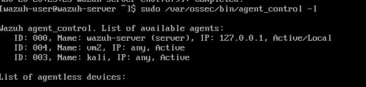

**Endpoints Summary — Wazuh Dashboard**

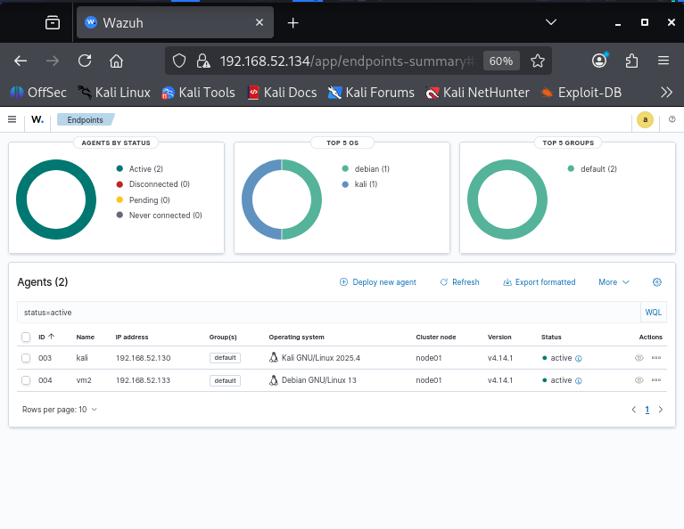

### Service Status Verification

| Wazuh-Server | Kali Agent | vm2 Agent |
|---|---|---|
| 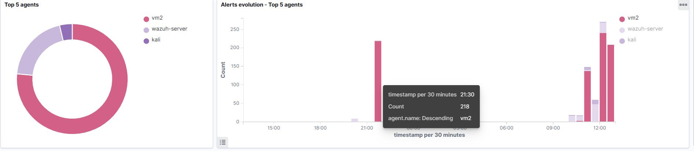 | 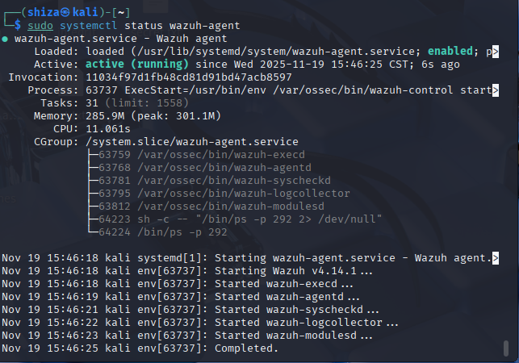 | 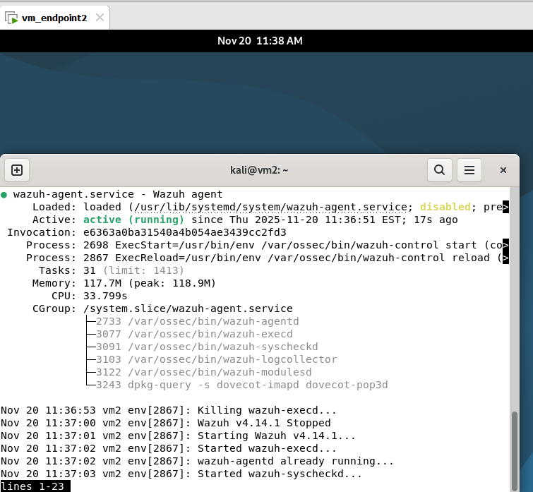 |

All three core services on the manager — `wazuh-manager`, `wazuh-indexer`, and `wazuh-dashboard` — were confirmed **active (running)**, and the `wazuh-agent` service was confirmed **active (running)** on both endpoints.

---

##  Use Case: SSH Brute-Force Attack Detection

### Attack Execution

| Detail | Value |
|---|---|
| Attacker | Kali Linux (`192.168.52.130`) |
| Target | vm_endpoint2 (`192.168.52.133`) |
| Tool | Hydra 9.6 with `rockyou.txt` wordlist |
| Command | `hydra -l root -P /usr/share/wordlists/rockyou.txt ssh://192.168.52.133` |

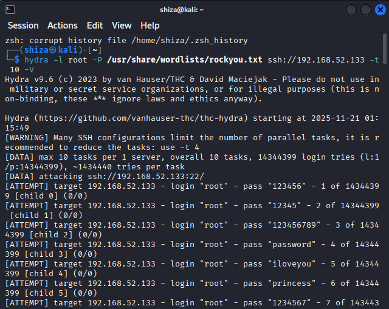

*Hydra brute-force attack in progress — real login attempts against `root` using passwords such as `123456`, `password`, `princess`, etc.*

### Detection Results

Wazuh instantly detected and classified the attack:

| Metric | Value | Description |
|---|---|---|
| Total alerts generated | **1,065** | During the attack window |
| Authentication failures | **580** | Direct result of Hydra attempts |
| Highest alert level | **12** | Multiple level 10–12 alerts triggered |
| Affected agent | **vm2** (`192.168.52.133`) | Clear victim identification |
| MITRE ATT&CK mapping | `T1110` Brute Force · `T1110.001` Password Guessing · `T1078` Valid Accounts | Correctly mapped to Credential Access tactics |

**Key rules triggered:**
- `40111` — Multiple authentication failures (Level 10)
- `5758` — Maximum authentication attempts exceeded (Level 8)
- `5760` — sshd: authentication failed (Level 5)

### Threat Hunting Dashboard

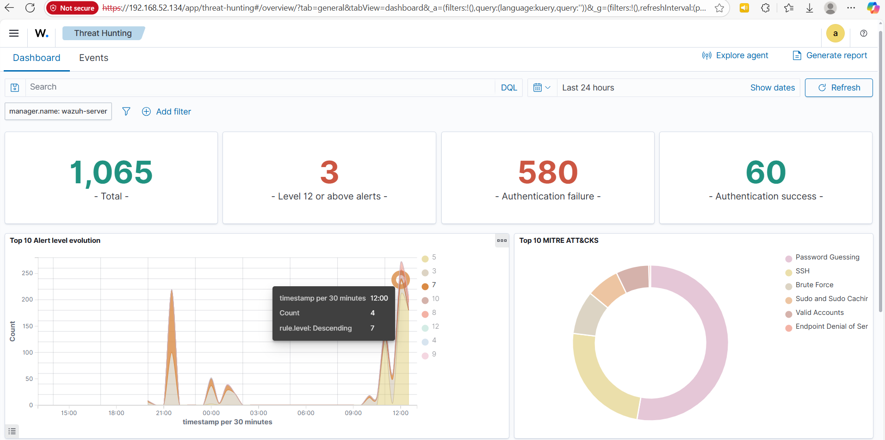

*1,065 total alerts, 580 authentication failures, and a clear spike during the attack window, with MITRE ATT&CK showing Brute Force and Password Guessing as the top tactics.*

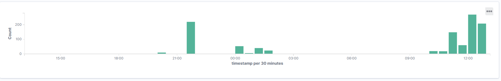

*Alert level evolution over time, with attack activity concentrated on the `vm2` agent.*

### Events List

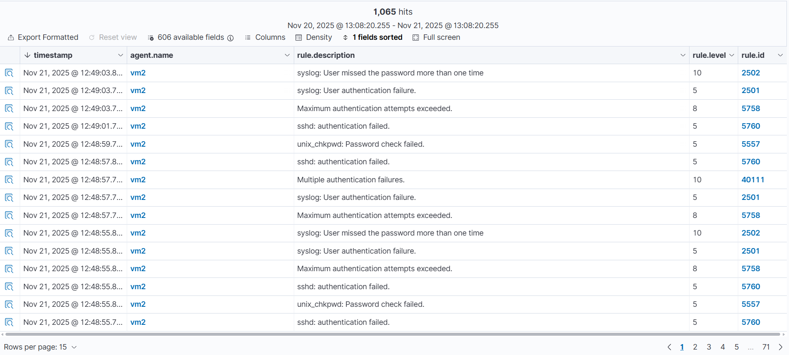

*1,065 hits on agent `vm2`, including "Multiple authentication failures," "Maximum authentication attempts exceeded," and "sshd: authentication failed."*

### MITRE ATT&CK Dashboard

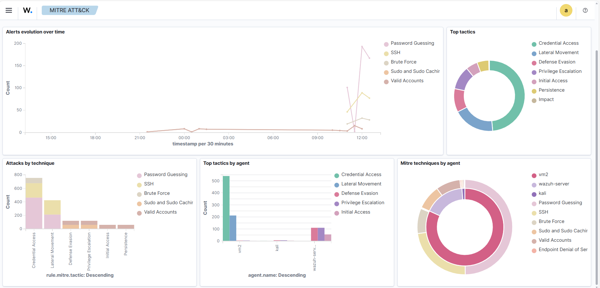

*Visual confirmation of attack classification under Credential Access → Brute Force / Password Guessing, broken down by technique and by agent.*

### Alerts Summary

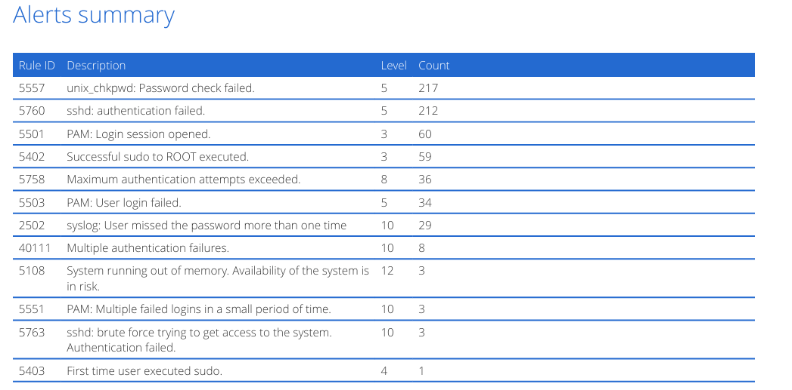

| Rule ID | Description | Level | Count |
|---|---|---|---|
| 5557 | unix_chkpwd: Password check failed | 5 | 217 |
| 5760 | sshd: authentication failed | 5 | 212 |
| 5501 | PAM: Login session opened | 3 | 60 |
| 5402 | Successful sudo to ROOT executed | 3 | 59 |
| 5758 | Maximum authentication attempts exceeded | 8 | 36 |
| 5503 | PAM: User login failed | 5 | 34 |
| 2502 | syslog: User missed the password more than one time | 10 | 29 |
| 40111 | Multiple authentication failures | 10 | 8 |
| 5108 | System running out of memory. Availability of the system is at risk | 12 | 3 |
| 5551 | PAM: Multiple failed logins in a small period of time | 10 | 3 |
| 5763 | sshd: brute force trying to get access to the system. Authentication failed | 10 | 3 |
| 5403 | First time user executed sudo | 4 | 1 |

---

##  Conclusion

This POC confirms that a Wazuh All-in-One deployment can detect and classify SSH brute-force attacks in real time, correctly correlating raw authentication failures into high-severity alerts and mapping them to the appropriate MITRE ATT&CK techniques (Brute Force, Password Guessing, Valid Accounts) — all without any custom rule authoring, using Wazuh's built-in ruleset.

---

##  Repository Structure

```
.
├── README.md
└── images/
    ├── kali-ip-config.png
    ├── vm2-ip-config.png
    ├── wazuh-server-ip-config.png
    ├── agent-control-list.png
    ├── endpoints-summary-dashboard.png
    ├── wazuh-server-services-status.png
    ├── kali-agent-service-status.png
    ├── vm2-agent-service-status.png
    ├── hydra-bruteforce-attack.png
    ├── threat-hunting-dashboard.png
    ├── threat-hunting-alert-evolution.png
    ├── threat-hunting-events-list.png
    ├── mitre-attack-dashboard.png
    └── alerts-summary-table.png
```

## 🛠️ Tools Used

- [Wazuh](https://wazuh.com) 4.14.1 (Manager, Indexer, Dashboard)
- VMware Workstation
- Kali Linux
- [Hydra](https://github.com/vanhauser-thc/thc-hydra) 9.6
- `rockyou.txt` wordlist
